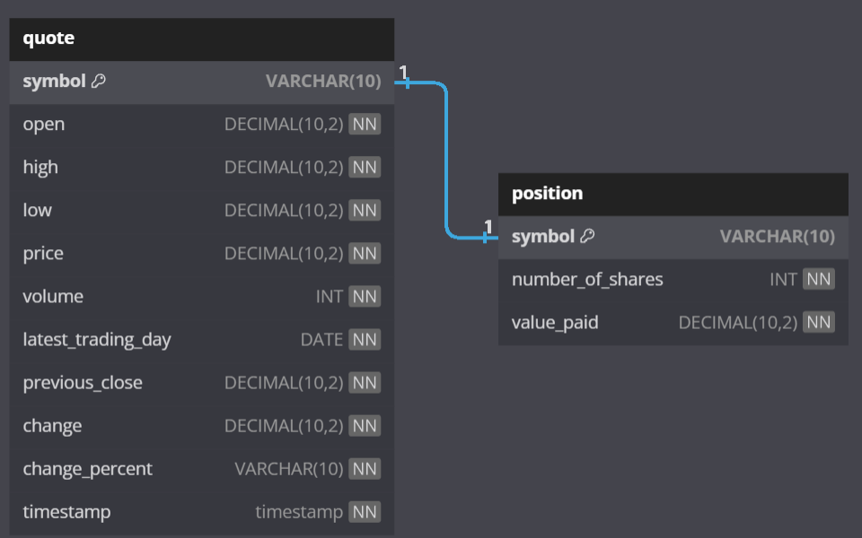
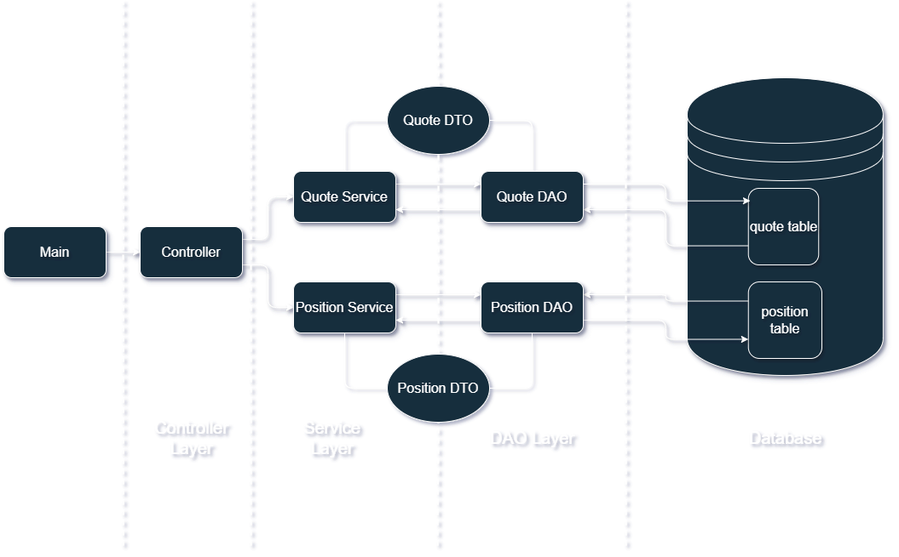

# Stock Quote Application
## Introduction / Overview
This Project is a Personal Stock Wallet Application that allows users to effortlessly buy, sell, and track all their
stocks in one place. Developed using core Java and managed with Maven, it ensures a smooth
experience. Efficient data storage is powered by PostgreSQL via JDBC, while Docker makes deployment a
smooth sail inside a portable container, accessible across various platforms. 

## Prerequisites
### Getting API Key
1. Visit [this](https://rapidapi.com/alphavantage/api/alpha-vantage) website.
2. Register yourself.
3. Get the free api key.
4. Add the API Key in `properties.txt` file.

### Setting up a Database
Before starting out, setting up a database is required. It can either be hosted on local machine or inside
a container. Depending on where you host it, there might be a slight difference in the configuration file. 
There are two tables involved.
1. Under `scripts` directory, run the scripts in order to setup the database and populate it as well.
2. `quote`: This table serves as a central repository for all the data related to stocks.
3. `position`: This table serves as the user's personal wallet. 

**NOTE:** Syntax may change depending on the type of database you use. Scripts are supported for PostgreSQL 

### Configuration File
The configuration file defines the fields which are required to connect to the database. It has 6 fields
1. `server` - The identifier which mentions on which server the database is being hosted.
2. `database` - The database name inside the instance.
3. `port` - The port number on which the database will listen to (e.g. 5432 for postgres).
4. `username` - Username for database.
5. `password` - Password for a specific user.
6. `api-key` - API-Key for fetching the stock details from the API endpoint.
#### Local Instance 
If you have the database inside the local instance, the server field inside the `properties.txt` file would
be 
`server:localhost`

#### Containerized Database
If the database is inside a docker container, the server field inside the `properties.txt` file would
be as follows
1. The IP-address of the container if both containers are under the same default bridge network.
    
   `server:[IP-address]` 
2. The container name itself if both containers are under the same user-defined network. 
   `server:[container-name]` 

Refer [this](https://docs.docker.com/network/drivers/bridge/) for docker networking if needed.

## Quick Start
### Directly with JAR File
1. After cloning the project from GitHub, open the project in any of your Java IDE.
2. Edit the properties.txt file with your custom configurations.
3. Navigate to the project directory (Same level as `pom.xml` file) from the terminal and run the command `mvn clean install` to build the project.
4. Once the project is built successfully, simply run the project with `java -jar [name-of-jar-file.jar]`

### With Docker
**NOTE**: If you are using Linux, you'll have to download and install Docker Engine first. If you're using Windows or MacOS, you'll need Docker Desktop which will have Docker Engine.
1. Download the Docker Image from [here](https://hub.docker.com/repository/docker/clandoor/stockquote/general).
2. Once the image has been downloaded, container can be run instantly.
3. To create and run the container, run the following command 
   `docker run --rm -i --name stockquote clandoor/stockquote` 
   Option `-rm` will instantly delete the container once it is done running. 
   Option `-i` will enable the user to interact with the container (Here, it will let the user interact with the java application). 
   Option `--name` lets you give a customized name to the container

## Implementation
### ER Diagram

### Application Design

### Design Patterns
Design patterns are used to implement this application keeping in mind the best practices
in the industry. 

#### DAO (Data Access Object)
The DAO layer of the application only handles the operations related to the databases thus
keeping the rest of the modules isolated from the database.
Inside the project, it is under `ca.jrvs.apps.stockquote.dao` package.

#### Services
The Services are the brain of the application which performs the business logic such as making transactions.
Inside the project, it is under `ca.jrvs.apps.stockquote.services` package.

#### DTO (Data Transfer Object)
The DTO layer represents the entities as classes in the code thus being useful for exchanging data between various modules
Inside the project, it is under `ca.jrvs.apps.stockquote.dto` package.

#### Controller
The Controller layer of the application dictates the flow of the application.
Similar to a User Interface.
Inside the project, it is under `ca.jrvs.apps.stockquote.controller` package

## Testing
- Robust Testing was performed for each module of the application to ensure the robustness of the application.
- Unit tests and Integration tests were written as required utilizing JUnit 5 and Mockito (Under the `test` folder).
- Separate database environment was set up solely for testing.

## Deployment
- Docker and GitHub were utilized to deploy this application. 
- Base image `amazoncorretto:17-alpine3.19` was utilized. 
- Containerization was implemented encapsulating all the necessary dependencies inside a container allowing it to be used efficiently across all platforms. 
- GitHub along with GitFlow branching strategy was implemented to deliver and write consistent code.

## Troubleshooting
- Robust logging has been implemented which makes troubleshooting the problems much easier. 
- Simply open `logs/errors.log` file to see cause and details of the issue if encountered.
- For more reference, refer to `logs/application_flow.log` file to trace the flow of the application to pinpoint the issue.

## Future Enhancements
1. Introduce a Graphical User Interface of the application making it easy for the end users to use the app and navigate easily.
2. Automate a functionality which updates the stock data in `quote` table once every day.
3. Provide more insights of all company stocks which the user owns in their wallet showing details for each such as net profit, recommended steps (Sell or Hold), future prediction etc.