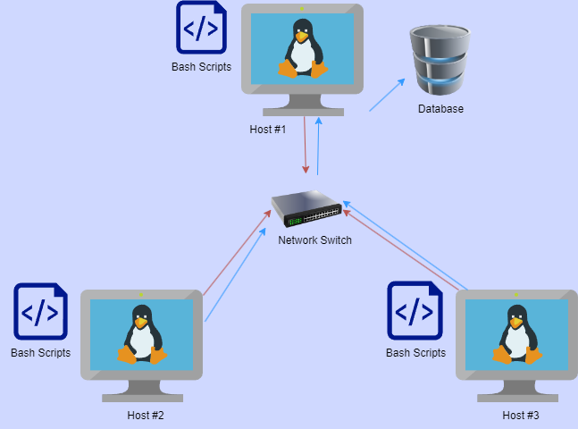

# Linux Cluster Monitoring Agent
## Overview
This project is intended for the Jarvis Linux Cluster Administrator Team (LCA). This project gathers the real-time data from all the available machines such as hardware specifications (CPU, Memory, etc.). This data is persisted in a relational database providing accurate records of data at a particular timestamp. This data will be used by the LCA team to manage resources. This project can be deployed across multiple host machines to enable real time data gathering.
The technologies used for this project are Postgres Database, Docker, Git, GitHub and Linux.

## Quick Start
1. Starting the PSQL Instance.
    - Run the bash script `psql_docker.sh`. If it is the first time, then simply create a docker container by typing `./psql_docker.sh create [database_name] [database_password]`. This will create a container with psql image with the database mentioned in CLI.
    - Once the container is created, simply run it by command `./psql_docker.sh start` which will start the container allowing to connect with the database.
    - Similarly, `./psql_docker.sh stop` command to stop the container.
2. Once the database is created, it is time to create tables inside it. Use the file ddl.sql (/sql/ddl.sql).
    - Run the following command `psql -h localhost -U postgres -d [database_name] -f sql/ddl.sql`. This will generate the required tables inside the database.
3. Inserting the hardware data inside the database.
    - Simply run the file `host_info.sh` which will gather the hardware specifications of the host machine and store it inside the table.
    - Run the command `./host_info.sh localhost 5432 [database_name] postgres [database_password]`.
4. Inserting the real time hardware usage data inside the database.
   - Running the `host_usage.sh` file will gather the real-time hardware usage data of the host machine and store it inside the table.
   - Run the command `./host_usage.sh localhost 5432 [database_name] postgres [database_password]`.
5. To get the real time hardware usage data every specific interval, the process has to be automated. Crontabs are utilized for this purpose.
    - Schedule the script to run every one minute using `crontab` command.
    - Run the command `crontab -e` which will let the user edit crontab.
    - Inside the file, write the command `* * * * * bash /home/centos/dev/jarvis_data_eng_Siddharth/linux_sql/scripts/host_usage.sh localhost 5432 host_agent postgres password >> /tmp/host_usage.log`.
    - This will run the script every one minute to get the real time data and store the result of the script in `host_usage.log` file under `tmp` directory for reference.

## Implementation
1. Setting up the GitHub Repository.
   - Creating the branches as per the GitFlow strategies and initializing files.
2. Setting up the Docker.
   - Downloading the docker and writing a bash script to create, start and stop the docker container with psql image.
3. Initializing the Database.
   - Creating a new database for the project.
   - Adding tables inside the database which contains the fields for CPU Hardware and CPU Usages.
4. Writing bash scripts for Inserting the data.
   - The scripts would gather the hardware specifications along with usage data from the host machine and insert the data into the database from the scripts interacting with the psql instance inside the running docker container.
5. Automating the Script.
   - Implementing the `crontab` command, the script `host_usage.sh` would run every one minute to gather the real-time data usage from the machine storing it inside the database.

## Architecture

## Scripts
- `psql_docker.sh` script creates a container with the postgres database image. Once the container is created, it can start and stop as needed.
- `host_info.sh` gathers the hardware specifications of the machine and stores them inside the database.
- `host_usage.sh` gathers the real-time resource usage data and stores it inside the database.
- `crontab` is used to automate the execution of `host_usage.sh` script by executing it every minute.
- `queries.sql` consists of queries to answer business questions.

## Database Modelling

### Host Information Table
| id (PK) | hostname | cpu_number | cpu_architecture | cpu_model | cpu_mhz | l2_cache | timestamp | total_mem |
|---------|----------|------------|------------------|-----------|---------|----------|-----------|-----------|

### Host Usage Data Table
| timestamp | host_id | memory_free | cpu_idle | cpu_kernel | disk_io | disk_available |
|-----------|---------|-------------|----------|------------|---------|----------------|

## Test
The following project is tested on one linux host machine.
The bash scripts were extensively tested covering the sets of all possibilities.

## Deployment
GitHub, Docker and Cron were used to deploy the project.
Containerization was implemented encapsulating all the necessary dependencies inside a container allowing it to be used efficiently across all platforms.
Cron was used to automate the execution of the `host_usage.sh` script enabling it to run every minute thus allowing real-time data collection.
GitHub along with GitFlow branching strategy was implemented to deliver and write consistent code.

## Future Enhancements
- Introduce more tables to manage more diverse types of data.
- Make the Project open-source so developers on the internet can improve it and use it as needed.