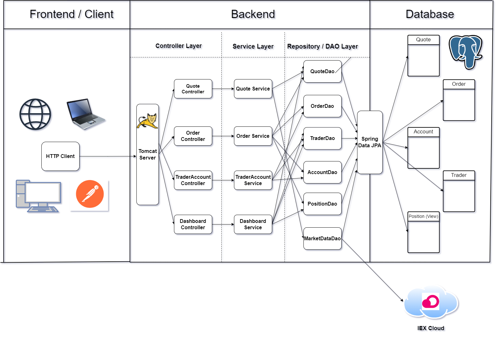

# Table of Contents
* [Introduction](#introduction)
* [Prerequisites](#prerequisites)
* [Quick Start](#quick-start)
* [Implementation](#implementation)
* [Test](#test)
* [Deployment](#deployment)
* [Future Enhancements](#future-enhancements)

# Introduction
This application is an online stock trading REST API developed to improve Jarvis' legacy and monolithic application. This application allows the users to buy and sell stocks, manage their accounts and stock portfolios. Built in core Java and Spring boot utilizing maven for project management and PostgreSQL for database, this application mimics microservices architecture making it easier to scale. Docker is used to deploy the application in container making it lightweight and portable across all platforms.

# Prerequisites
## Getting the API Key
1. Visit IEX website and Register yourself
2. Get the public API key

## Docker
1. Before starting out, make sure to have Docker Engine on your Operating System (Or Docker Desktop if you're using MacOS or Windows).
2. Some basic knowledge of docker is highly desired.

# Quick Start
NOTE: If you are using linux, you'll have to download and install Docker Engine first. If you're using Windows or MacOS, you'll need Docker Desktop which will have Docker Engine.
1. Download the docker images. <br>
   ```
   docker pull clandoor/stock-trading-app:trading-psql
   docker pull clandoor/stock-trading-app:trading-app
    ```
   The `trading-psql` contains the postgres database inside the image with starter-data and schemas initialized. <br>
   The `trading-app` contains the packaged java spring boot application inside the image.

2. Now, create a custom network for the container to be deployed on so they can communicate with each other. <br>
   ```
   docker network create trading-net
   ```
   
3. Now, create the container for database and attach it to the above network.
   ```
   docker run --name trading-psql-dev \
   -e POSTGRES_PASSWORD=admin \
   -e POSTGRES_DB=postgres \
   -e POSTGRES_USER=postgres \
   --network trading-net \
   -d -p 5432:5432 -t clandoor/stock-trading-app:trading-psql
   ```
   
4. Similarly, create the container for the application and attach it to the same network.
   ```
   docker run --name trading-app-dev \
   -e "IEX_SUB_TOKEN=YOUR_OWN_KEY" \
   --network trading-net \
   -d -p 5000:8080 -t clandoor/stock-trading-app:trading-app
   ```
   
   Option `--name` lets you give a customized name to the container. <br>
   Option `-e` lets you pass environment variables in the docker container. <br>
   Option `-d` lets you run the container in detached mode (In background)
   **NOTE:** Keep the port 8080 in the application container since the tomcat server is hosted on port 8080.

5. Access the application / exposed endpoints at the URL http://localhost:5000/swagger-ui/index.html <br>
   
   
# Implementation
## Architecture 

### Design
This architecture is Restful architecture along with MVC. The endpoints are left exposed to the client and its up to the clients (e.g. frontend) on how to consume these endpoints / application.
### Controller Layer
The controller layer handles the HTTP requests with the help of Spring's servlet container and is responsible for controlling the flow of application. It essentially acts as a communicator, getting the data from the API requests, converts it into a more desirable form and then passes it on to the service layer.
### Service Layer
The service layer consists of all the business logic of the application. It communicates with the Repository / DAO layer thereby fetching the required data, processes it and performs the business logic and returns the data back to the controller layer.
### Repository / DAO Layer
This layer is responsible only for interacting with the database keeping the rest of the application isolated from the database. This promotes loose coupling and makes the application more flexible and easier to scale.

# Test
Integration testing was performed on each module of this application to ensure its robustness.
- Separate database was set up for integration testing purposes only.
- Junit 5 was utilized along with Spring boot helper packages to carry out testing.
- Each service has its own integration tests covering all possibilities (High code coverage)

# Deployment

- Two docker images were used in this application.
- Both these images run in different containers making this application lightweight and flexible.
- The database image already has all the tables associated with the application loaded along with some starter-data in the `quote` table.
- Both these containers run on the same network `trading-net` so they can communicate with each other.

# Future Enhancements
1. Design a Front-end for this application to make it a Full-Stack application allowing the users to interact with it via a decent UI.
2. Allow the traders to have multiple accounts instead of one.
3. Develop more Service classes so respective service only interacts with its respective DAO.
